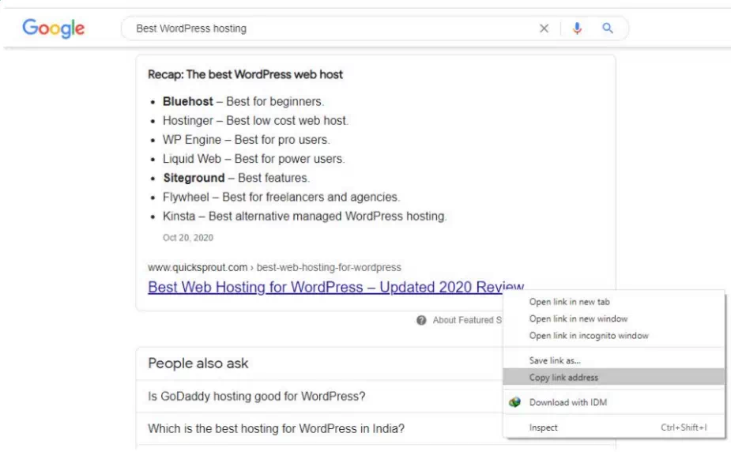
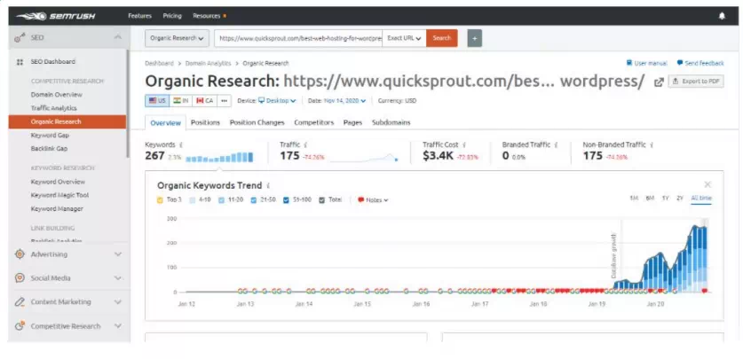
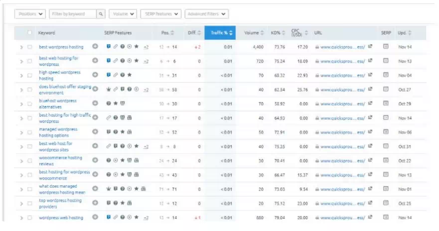
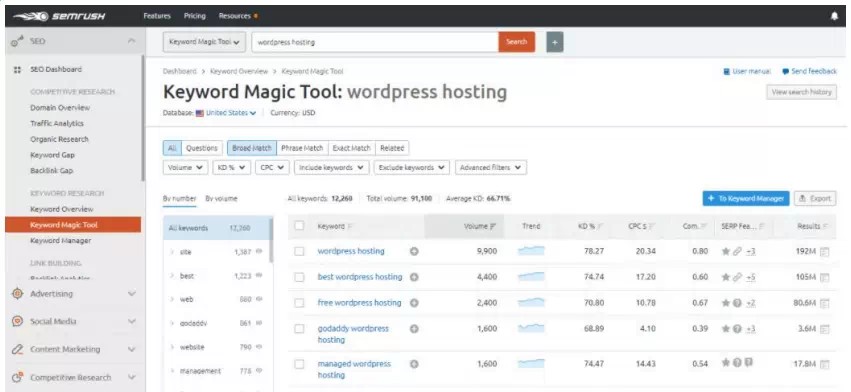
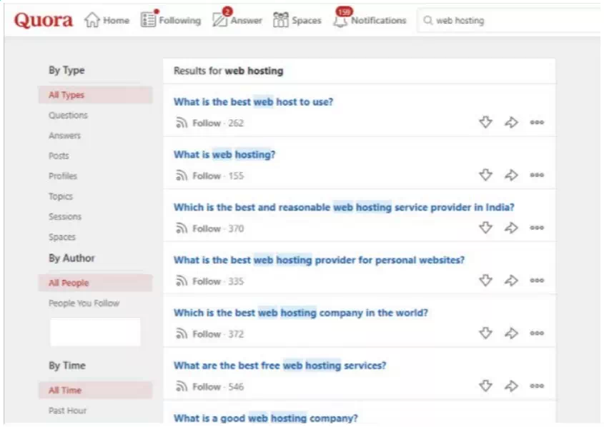
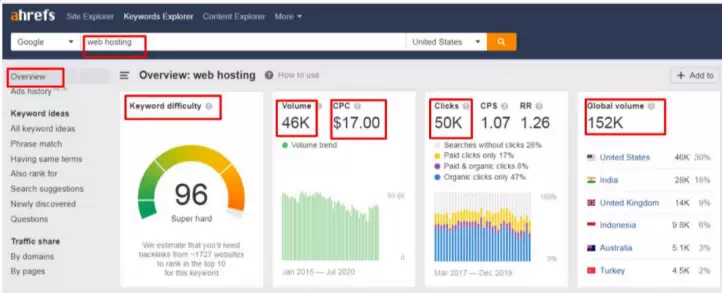

# 第一章 关键词研究概述

## 什么是关键词研究?

关键词研究，就是找到你的目标受众在搜索与你业务相关内容时会用到的词和短语。

除了关注具体关键词的流量和数据，它还会探索客户是如何搜索行业相关主题的。通过有效的关键词研究，你能知道当下市场上什么是有需求的。所以，它是搜索引擎优化、广告和内容营销中非常重要的一部分。

它能让你清楚了解客户在找什么，他们是怎么搜索内容的，他们习惯用什么样的语言，以及你需要创作什么类型的内容来满足他们的搜索意图。

关键词研究分为两种类型：
* **自然关键词研究** —— 主要是找出自然关键词，用来优化内容以提升 SEO。
* **PPC 关键词研究** —— 指的是按点击付费广告，你需要付费，让自己在 Google Ads 里针对行业相关的关键词获得排名。

你是不是已经有了内容创意，但却不知道怎么把它变成受众真正想看的、能消费的内容？

关键词研究能帮你挖掘新的内容想法，并揭示新的主题来创作内容。

总结一下，关键词研究就是弄清楚并理解你的 **目标受众所使用的语言**。如果你在内容里说的是他们的语言，就能 **建立共鸣**，从而带来更高的互动和转化。

按照旧的定义，“不带关键词的内容创作就是浪费时间，因为如果你的内容没有用对关键词进行优化，它根本不会出现在搜索结果里。”

但这种做法并不能真正为用户提供更好的搜索结果。过去人们常常在内容里塞满关键词，看起来既不专业，又让 Google 很头疼。于是，Google 改变了关键词的运作方式，也改变了你该如何做关键词研究。

关键词研究的概念还是一样的，但它对搜索引擎排名的影响已经变了。网上那些过时的内容会告诉你，必须用完全匹配的关键词才能在 Google 排名，但事实并不是这样，我会在这本书里证明给你看。

我会告诉你如何正确地做关键词研究，为什么现在不再那么需要去找完全匹配的关键词，为什么依然有必要去研究关键词，以及它是如何影响你的搜索引擎排名的。

同时，我还会教你如何最大化利用关键词研究的过程，让你在 Google 搜索结果中获得更高的排名。

我相信这本书会一直引导你完成关键词研究的过程，等你读完之后，你就会成为关键词研究的高手。

你将在第二章学到更多关于不同类型关键词的内容。

关键词研究能告诉你：
- 你的目标受众
- 你的竞争对手
- 应该瞄准的正确关键词
- 你应该创作的内容类型
- 每个关键词的月搜索量
- 用户的搜索意图
- 如何帮助提升转化率
- 排上某个关键词所需的 SEO 努力程度
- 新的内容主题创意

## 为什么关键词很重要

做关键词研究是必须的，它能帮你了解客户和访客真正想要什么，并创作出能满足他们搜索需求的内容。

几乎所有网站主都会根据自己认为用户需要的东西来写内容，但实际上他们并不知道用户真正想要什么。

另一方面，如果你在不了解某个主题潜力的情况下就发布内容，不管你怎么努力，都吸引不到来自 Google 的流量。如果没有人搜索你发的内容，那就根本没有流量可言。

而且，仅仅因为某个关键词有很高的搜索量，并不代表它就是理想的关键词。因为它可能跟你的内容没什么关系。只有当你**真正满足了搜索需求**时，才有可能在搜索结果中获得更高的排名。

而且，如果排名再高，但**访客没有转化**，这又有什么意义呢？

所以，关键词研究能提供衡量标准，让你理解上面提到的这些问题。

根据 Ahrefs 的研究，至少有 **90.63%** 的网页在互联网上没有获得任何流量，原因就是缺乏有效的关键词研究。

我并不是说关键词研究是唯一能让你在搜索结果里排名更高的因素，其他因素当然也很重要，但关键词研究是搜索引擎排名的基础。

如果你不想成为那 90.63% 的网站之一，而是想像那 9% 一样在搜索结果中获得更高排名，你就必须重视有效的关键词研究。

关键字研究看起来很复杂，尤其是对于新手来说会这么觉得，但其实并不是。

相反，我会给你展示一个非常简单、一步步的关键词研究流程。

## 如何进行关键词研究

在讲具体的关键词研究流程之前，我先说两个需要注意的点：  
一定要记住——  
- **什么对你的业务最重要** —— 不要只盯着那些专注于卖东西的商业关键词，你的关键词研究必须以客户为中心，关注客户真正想从你这里得到什么。
- **你的业务目标是什么** —— 除了考虑客户的需求，你还应该结合自己的业务目标来做关键词研究。比如，你是想直接卖产品，还是想通过提供信息来获取潜在客户？

带着这两个重点，我们开始关键词研究吧。

### 步骤一：寻找关键词想法

#### 1. 头脑风暴并列出清单

你已经知道自己业务的基本主题，用户可能会搜索这些内容。即使你不太确定，至少你清楚自己提供的产品和服务类型。

所以，你的任务就是动脑想一想，把可能的搜索词列成一个关键词清单。有了关键词想法清单，你的关键词研究过程就会快得多。

不用担心清单的准确性，它只是为了帮你理清可能的搜索方向。接下来我们会进一步扩展，并从中挑选出最合适的关键词。

比如说，如果你卖的是皮夹克，潜在的搜索词可能包括：皮夹克，男士皮夹克，女士皮夹克，品牌皮夹克

#### 2. 寻找竞争对手的关键词

借鉴竞争对手的关键词是最有效的关键词研究方法之一。你的竞争对手在你的业务领域已经做了很多，他们在正确的关键词上提供了优秀的内容，所以才能够排名靠前。通过分析竞争对手的关键词，你还能了解到自己需要创作什么样的内容，才能在 Google 搜索结果中排到前面。

* a)：要找出竞争对手的关键词，只需把你头脑风暴列表里的关键词在 Google 上搜索即可。 

  例如——我搜索了 “best WordPress hosting”，结果出现了大量网页，但不幸的是，这些都是我的竞争对手。  

* b)：复制他们的网址，并通过 SEMrush 的关键词研究工具进行分析（下面章节会详细讲解）。  

  进入 SEMrush 仪表板，把网址放到 SEO > Organic Search 中，粘贴你的 URL，并从下拉菜单中选择精确域名。  
  
  然后点击 Organic Keywords，你就能得到竞争对手的高排名关键词列表。  
  

把这些关键词添加到你头脑风暴的关键词清单里。

#### 3. 使用关键词研究工具

把你清单里的关键词一个个放进关键词研究工具，挖掘更多关键词。我在本教程中使用的是 **SEMrush (Keywrod Magic Tool)**。  
我输入了以下关键词，得到了大量的关键词想法。

#### 4. 研究你的细分领域

即便经过头脑风暴、找竞争对手关键词和使用关键词研究工具，你可能仍然会遗漏一些最重要的关键词。所以，研究你的细分领域能帮你发现这些遗漏的关键词，同时也能让你了解客户的问题和语言习惯。

要通过研究细分领域获得额外的关键词想法，可以利用 **公开社区**，比如 **Quora** 和 **Reddit**。

你只需在 Quora 搜索你的核心关键词，就能找到大量与该关键词相关的 **问答内容**。

向下滚动，把所有重要的关键词记录到你的清单里。

现在你已经有了一个包含大量关键词想法的大清单，但你需要筛选，把列表精简，找出最优的关键词。这就引出了第二步。

### 步骤二：寻找长尾关键词

在这一步，我们会通过去掉不必要的关键词来精简清单。你不能只针对清单里的核心关键词，而是需要在这些关键词的基础上进行**扩展**， **创造长尾关键词**。

以下是从核心关键词生成长尾关键词的资源：

- AnswersThePublic.com —— 下面章节会详细讲解
- Google 自动建议 —— 下面章节会详细讲解
- Long Tail Pro —— 下面章节会详细讲解
- 关键词研究工具里的问题板块 —— 下面章节会详细讲解

### 步骤三：分析关键词

在创建长尾关键词后，你的清单会变得更长。现在，你需要通过 SEO 工具对每个关键词进行分析，了解不同的指标。

把你的关键词清单放进 SEMrush 或 Ahrefs，然后分析以下指标：

- 关键词难度
- 搜索量
- CPC（每次点击成本）
- 相似关键词
- 关键词的变体
- 目标地域
- 关键词趋势

我们将在第四章详细讲解每一项指标。

筛选掉以下关键词：
- **月搜索量少于 5K 的**
- **关键词难度高于 40 的**
- CPC 低的（根据关键词可能有所不同）
- 目标地域不在你的业务范围内的
- 不是常青关键词，并且全年趋势下滑的

现在，你就拥有了最终的关键词清单，可以用在内容创作过程中。这些关键词将帮助你在搜索结果中获得更高排名，同时确保你的 SEO 投资回报最大化。

## 如何通过关键词研究在 Google 排名第一

要在 Google 排名第一，你必须严格按照关键词研究流程中的所有步骤操作。除此之外，还有一些额外步骤可以进一步提升你的关键词研究效果，让整个过程更有威力。

**理解用户意图** —— 在关键词研究和内容创作中，理解用户意图至关重要。因为 Google 展示搜索结果时，是根据搜索意图，而不是关键词在内容中出现的次数来排序的。

举个例子：如果你的博客是关于足球比赛资讯的，你的目标受众想看的是足球比赛内容，而不是购买足球用品。

如果你去针对像“5000 元以下最佳足球”、“初学者用足球”这样的关键词，那就是错误的关键词研究方式。你的受众可能对这些关键词感兴趣，因为它们相关，但它们不是你的理想关键词。

你的用户意图是想了解足球比赛如何进行，他们并不想买东西。在这种情况下，你应该使用信息类关键词而不是商业类关键词。

**相关性** —— 在把关键词通过 Ahrefs 和 SEMrush 分析后，下一步是根据相关性精简关键词清单。仅仅在内容中提到关键词，并不能让你在 Google 排名更高。即便你创作了高质量内容，但如果不是用户真正想要的，也没有用。只有当你创作的内容正好满足用户对主题的需求时，才会获得更高排名。

举个例子——如果你在内容里多次堆砌“下载《华尔街之狼》电影”的关键词，希望排在搜索结果前列，那你就是错的。因为你的受众想下载电影，他们在找能提供下载链接的资源，而不是看文章内容。

另一个例子——Google 也会把内容长度作为排名因素。内容越长、越深入，排名通常越高。但如果你的页面上内容无用或未经发布，那么再长也没有意义。在这种情况下，短一点的内容反而更好。只有与关键词相关的内容才会被计算在内。

**权威性** —— 在最终确定任何关键词之前，最后一步是检查是否已有高权威网站在该关键词下排名。如果有，你很可能无法在同一关键词下超越它们。这种情况下，你可以寻找长尾关键词的替代方案。

举个例子——当我搜索“戒烟”时，会看到 Healthline、WebMD 以及其他高权威健康网站位列前列。我们无法与它们竞争，因为它们已经存在多年，投入了大量资源，多年来有大量医疗专业人士在撰写和发布内容。

Google 认为它们是可信的健康信息来源。如果你想与它们竞争，就必须投入同样的时间和精力。

## 本节总结

你不需要在内容中刻意堆砌完全匹配的关键词。关键词研究的目的，是了解主题的潜力，并用受众正在使用的语言创作最优内容。

在关键词研究过程中，你必须避免以下错误：

**瞄准宽泛关键词** —— 如果你选择“鞋子”、“手套”、“自行车”等宽泛主题的关键词，你将不得不与大品牌竞争，因为它们搜索量高，所以大公司会瞄准这些关键词。它们拥有高权威网站，并长期持续创作大量优质内容。

你无法在“戒烟”这个关键词上排上前列，因为像 Healthline 这样的顶级健康网站已经在排名前列，多年来有大量医疗专家在发布内容，你无法与之竞争。

另一方面，如果你瞄准窄主题关键词，比如“大学生戒烟”，虽然流量较少，但排名机会更高。

**瞄准高竞争关键词** —— 如果其他大品牌的高权威网站已经在该关键词下排名，你应该寻找该关键词的替代词或长尾关键词。

**瞄准无法转化的关键词** —— 如果你有一个电商网站，或者你的业务目标是卖东西，那么瞄准信息类关键词对你不起作用。你需要瞄准商业类关键词（我们将在后面章节详细讲解这些关键词类型）。

**只尝试同时排名一个关键词** —— 你的网页必须有一个主关键词，但它可以同时针对多个相似关键词排名。你需要找到 LSI（潜在语义索引）和相似关键词，并在内容中使用它们，而不是只针对单个关键词排名。

**持续追踪关键词排名并优化内容**

关键词研究是一个持续的过程。即便你某个关键词已经排名靠前，也不意味着位置会永远保持不变，也不意味着网站流量会一直稳定。排名是动态变化的——无论你的内容多么优秀，排名持续多久，搜索引擎的位置都会随时间波动。

因此，最好定期检查关键词排名，并保持内容更新，以维持在搜索引擎中的排名（我们将在后面章节详细讲解这个过程）。