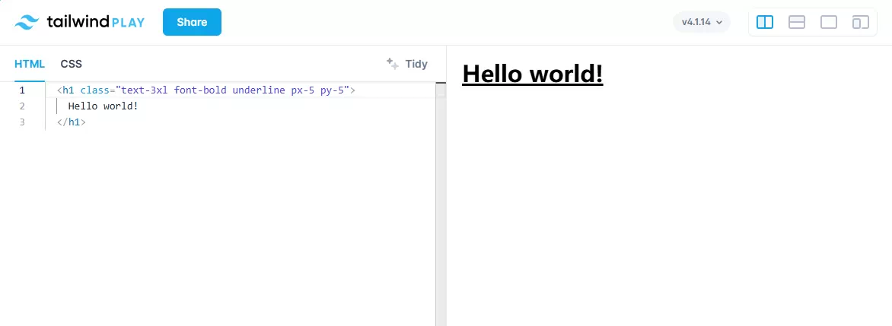

# 第 1 章 Tailwind 入门


在深入了解 Tailwind 的工具类之前，先快速浏览一下，感受 Tailwind CSS 是如何工作的。

Tailwind 既是一套实用工具类，也是一款根据这些类生成 CSS 文件的工具。它还提供了 `@apply` 指令，让你可以组合 Tailwind 类。要开始使用 Tailwind，我们首先需要安装框架本身，然后将其接入 CSS 处理工具链。首先，我们来看看 Tailwind 的命令行工具（CLI）能做什么。

## Tailwind CLI 的作用

作为一套工具类，Tailwind 提供了丰富的模式，让你可以将 CSS 类分配给代码中的 HTML 元素。

使用 Tailwind 时，你编写的 CSS 类名要符合 Tailwind 定义的模式。例如，你写 `<div class="m-4">`，Tailwind 会在 CSS 中定义为 `.m-4 { margin: 1rem; }`。Tailwind 的模式非常多样，而且可以与不同的修饰符组合，甚至在许多情况下允许使用任意值，这意味着它可能生成数百万种不同的 CSS 类。实际上，要枚举 Tailwind 可能定义或使用的所有类是不现实的，而你的项目通常只会用到其中的一小部分。

如果把所有潜在类（绝大多数未使用）都定义出来并发送到浏览器，会造成巨大的性能问题。为了解决这个问题，Tailwind 使用了“即时编译引擎”（JIT engine）来检测你实际使用的 CSS，并限制生成的 CSS，只生成项目真正需要的 CSS。Tailwind 为这个引擎提供了命令行工具（CLI），你的前端构建工具可以使用这个 CLI 来生成项目所需的 CSS。


你需要向 Tailwind 提供项目中声明 CSS 类的文件列表，Tailwind 会扫描这些文件，查找与 Tailwind 类匹配的文本模式，然后生成一个只包含实际使用到的 Tailwind 类的 CSS 文件。

Tailwind 的命令行工具运行速度很快，并且倾向于多包含一些类，而不是去猜测某个类（比如 `m-4`）是否真的是 CSS 声明的一部分。如果文件中任何地方出现了 `m-4`，Tailwind 就会把它加入生成的 CSS 文件。

这样做是合理的，因为 Tailwind 的类名模式足够独特，几乎不会意外出现，而且多包含一个类相比排除数百万未使用的类来说，代价很小，同时还能保证实际使用的 Tailwind 类都被包含进来了。

## [Tailwind CLI 使用方式](https://tailwindcss.com/docs/installation/tailwind-cli)

从零开始使用 Tailwind CSS，最简单、最快的方法就是用 Tailwind 的命令行工具（CLI）。如果你不想安装 Node.js，也可以使用独立版本的 [CLI 可执行文件](https://github.com/tailwindlabs/tailwindcss/releases/latest)。

- 安装 `Tailwind CSS`: 通过 npm 安装 tailwindcss 和 @tailwindcss/cli。
```
npm install tailwindcss @tailwindcss/cli
```
- 在你的 CSS 中导入 Tailwind。
在主 CSS 文件中添加这一行：`@import "tailwindcss";`
- 启动 Tailwind CLI 的构建流程。
运行 CLI 工具来扫描你的源文件中的类名，并生成对应的 CSS。
```
npx @tailwindcss/cli -i ./src/input.css -o ./src/output.css --watch
```
- 开始在你的 HTML 中使用 Tailwind。
把编译好的 CSS 文件加到 `<head>` 里，然后就可以用 Tailwind 的工具类来给内容添加样式了。
```html
<!doctype html>
<html>
<head>
  <meta charset="UTF-8">
  <meta name="viewport" content="width=device-width, initial-scale=1.0">
  <link href="./output.css" rel="stylesheet">
</head>
<body>
  <h1 class="text-3xl font-bold underline">
    Hello world!
  </h1>
</body>
</html>
```

## Tailwind Play 

[**Tailwind Play**](https://play.tailwindcss.com/) 是一个可以让你实时看到效果TailWind在线工具。如果你只是单纯地想学Tailwind css样式，它是非常好的动手练习的工具，直接上手，省去了安装配置的繁琐步骤。



## VSCode 

建议安装的插件

* Live Server
* Tailwind CSS IntelliSense
* PostCSS Language Support
* Prettier - Code Formatter
* Auto Rename Tag

网页模板文件如下；

```html
<!DOCTYPE html>
<html lang="en">
<head>
    <meta charset="UTF-8">
    <meta http-equiv="X-UA-Compatible" content="IE=edge">
    <meta name="viewport" content="width=device-width, initial-scale=1.0">
    <title>Document</title>
    <script src="https://cdn.jsdelivr.net/npm/@tailwindcss/browser@4"></script>
    <style type="text/tailwindcss">
      @theme {
        --color-clifford: #da373d;
      }
    </style>    
</head>
<body>
    <h1 class="text-3xl">Wel come to NorthBy</h1>
</body>
</html>
```


## 使用示例代码

这本书附带了一点示例代码，它是一组静态的 HTML 文件，用来读取一个静态的 CSS 文件。这个 CSS 文件是通过 Tailwind CLI 生成的，如果你想自己动手试试，可以在本地安装这个 CLI。

你可以直接用 Tailwind CLI 的独立版本来运行这些示例代码，它不需要 NodeJs 环境。这种方式在真正的前端项目里可能不是常用做法，所以你也可以看看下一节的内容。

要开始使用独立版的 Tailwind CLI，可以到 [https://github.com/tailwindlabs/tailwindcss/releases](https://github.com/tailwindlabs/tailwindcss/releases) 下载适合你操作系统的最新版本，然后把下载的文件放在本书代码目录的顶层，也就是和 tailwind.config.js 文件同级的位置。

你可能需要把下载下来的文件重命名成简单的 **tailwindcss**。
我这边的命令是：`mv tailwindcss-macos-arm64 tailwindcss`，
你用的命令可能会根据你下载的文件名不同而有所变化。

接着，你还需要给这个文件添加执行权限，比如运行：`chmod +x tailwindcss`，
当然，这一步的命令也可能因为你的操作系统不同而略有差异。

准备好独立版 CLI 之后，你就可以随意修改现有的代码，
或者在 `html` 目录下添加新的 HTML 文件。
然后运行命令：
`./tailwindcss -o css/output.css`
它会重新解析这些 HTML 文件，并重新生成 `css/output.css` 文件。
不用担心，我们会在后面的章节详细讲解这条命令的作用。

请注意，Tailwind CLI 的发布结构和命令方式在本书写成后可能已经有所改变。
如果你按照这些步骤操作时遇到问题，请到书籍的论坛查看最新的说明。

## 在你的应用中添加 Tailwind

在前端项目中安装 Tailwind 的过程，取决于你的项目是如何管理前端资源的。
因此，本书不会提供一个完整的安装指南——那样不仅超出本书范围，而且很快就会过时。
最权威、最及时的参考来源是 **Tailwind 官方文档**。
如果你在自己的项目环境中安装 Tailwind 时遇到困难，请去查看官方文档。

本节只是简单介绍一下大多数项目中安装 Tailwind 的一般流程。
Tailwind 的开发者推荐，大多数情况下，最简单的安装方式是通过 **NodeJS 版的 Tailwind 命令行工具**。
首先，你需要安装 Tailwind 本身：

`$ npm install -D tailwindcss`

接下来，运行下面这条命令来创建一个 **Tailwind 配置文件**：

`$ npx tailwind init`

这条命令会生成一个如下所示的空配置文件：

```js
tailwind.config.js
module.exports = {
content: ["./html/*.html"],
    theme: {
        extend: {},
    },
    plugins: [],
};
```

为了让 Tailwind CLI 正常工作，你需要在配置文件中添加一条信息：
告诉 Tailwind 哪些文件里可能会用到 CSS 类。

Tailwind CLI 会根据这些文件的内容来生成对应的 CSS，这就是我们在本章开头提到的 CSS 生成过程。

这些信息要写在配置文件的 **content** 属性里，
它使用的是标准的文件匹配语法：
`*` 表示匹配任意文本，`**` 表示匹配任意层级的子目录。

一个典型的 React 项目可能会像下面这样配置，
让 Tailwind 去扫描 `src` 目录下所有子目录中，
以 `.html`、`.js` 或 `.jsx` 结尾的文件：

```js
module.exports = {
content: ["./src/**/*.{html,js,jsx}"],
    theme: {
        extend: {},
    },
    plugins: [],
}
```

一个基础的 Ruby on Rails 项目配置可能是这样的：
它会匹配所有以 `.html.erb` 结尾的视图文件、
所有以 `.rb` 结尾的辅助文件，
以及所有以 `.js` 结尾的 JavaScript 文件。

```js
module.exports = {
    content: [
        './app/views/**/*.html.erb',
        './app/helpers/**/*.rb',
        './app/javascript/**/*.js'
    ],
    theme: {
        extend: {},
    },
    plugins: [],
}
```

你的项目设置可能会和这里的例子稍微不同，
但核心目标都是一样的：
让所有可能包含 CSS 类的文件都能被 Tailwind CLI 扫描到。

如果你使用 **Visual Studio Code**，
Tailwind 扩展插件会通过是否存在这个配置文件来判断项目是否在使用 Tailwind。
其他集成开发环境（IDE）或编辑器也有各自的插件或其他方式来支持 Tailwind。

最后，我们还需要在 **CSS 文件中引入 Tailwind**。
通常情况下，只要在被导入的 CSS 文件里加入下面几行代码即可。
具体放在哪个文件里要根据你使用的工具而定，
但最终效果应该像这样：
`css/input.css`
```js
@tailwind "tailwindcss/base";
@tailwind "tailwindcss/components";
@tailwind "tailwindcss/utilities";
```

这里我们通过三个层级来引入 Tailwind：
**base** 包含 Tailwind 的基础样式重置类，
**components** 是一个较小的层级，包含了 Tailwind 的组件类，
而本书的大部分内容都会围绕 **utilities**（工具类）层展开。

当你开始自定义 Tailwind 时，这些层级的顺序就变得很重要了——
如果你想用 Tailwind 的修饰符来组合自己的类，那么这些类必须在 **utilities** 层之前定义。

其他构建系统可能需要你使用 `@import` 而不是 `@tailwind` 作为命令，具体请以官方文档为准。

这些步骤应该可以让你开始使用 Tailwind 了。
接下来，我们来看一下 Tailwind 都能做些什么。

## 快速入门

我们将快速演示如何为一个名为 **NorthBy** 的音乐会系列示例页面设计 hero 区块。
代码里的示例页面会把所有版本依次展示出来。
这个页面只是我们服务器应用的公共 HTML 页面，所以不需要任何服务端信息来说明。（如果你在运行示例代码，可以直接在浏览器中打开 `intro.html` 页面查看。）

下面是我们的第一个版本：<br />
`html/intro.html`
```html
<h1>Welcome to NorthBy</h1>
```


你应该会看到文本完全没有任何样式，甚至连 HTML 的 `h1` 标签通常自带的大小和加粗样式也没有。
这是一个检查 Tailwind 是否安装成功的好方法。
如果你看到文本有任何样式，那说明 Tailwind 没有正确加载，需要重新按照安装步骤检查一遍。

我们来回切换代码和页面视图，开始用 Tailwind 添加一些功能。
我不会深入讲解语法或其他选项，
这里只是尽量通过书本的形式，让你感受一下使用 Tailwind 的体验。

我必须先说明，我不是设计师。

下面是一个初步尝试，用来实现包含文字、副标题和 logo 的基本布局：

```html
<div class="flex">
    <div>
        
    </div>
    <div>
        <h1>Welcome to NorthBy</h1>
        <h2>A premium in sight and sound</h2>
        <button>Learn More</button>
    </div>
</div>
```

这段代码会得到如下效果：


这和我们的第一个版本差别不大。
文本仍然没有任何样式，也没有间距或其他布局效果。

接下来我们做一些改动：

* 将文本居中
* 两部分文本之间增加一些间距
* 文本在垂直方向上与 logo 居中对齐
* 将 logo 放在右边

我使用的 Tailwind 类可以很好地表达这些意图：

```html
<div class="flex justify-center">
    <div class="mx-4 order-last">
        
    </div>
    <div class="mx-4 self-center">
        <h1>Welcome to NorthBy</h1>
        <h2>A premium in sight and sound</h2>
        <button>Learn More</button>
    </div>
</div>
```


我们在这里添加了一些类。
外层的 `div` 现在有两个 Tailwind 类：`flex` 和 `justify-center`。
图片有另外两个类：`mx-4` 和 `order-last`，
文本块也有 `mx-4` 和 `self-center`。

`mx-4` 类用来设置水平外边距，
其他的类都是通过 CSS 的 **flexbox** 布局来处理元素位置的，
我们会在第 48 页的 “Flexbox” 章节中详细讲解。

接下来，我们来调整文本：

* 将标题变大
* 副标题稍微小一点
* 所有文本居中

同时给整个区域加上一个背景：

```html
<div class="flex justify-center bg-gray-300">
    <div class="mx-4 order-last">
        
    </div>
    <div class="mx-4 self-center text-center">
        <h1 class="text-6xl font-bold text-blue-700">Welcome to NorthBy</h1>
        <h2 class="text-3xl font-semibold text-blue-300">A premium in sight and sound</h2>
        <button>Learn More</button>
    </div>
</div>
```

这给外层 `div` 添加了一个新类 `bg-gray-300`，用来设置背景颜色。
我们还给文本元素添加了许多类，并用 `text-center` 让文本居中。

标题元素现在有 `text-6xl font-bold text-blue-700`，
分别指定了字体大小、字体粗细和颜色。
副标题则更小、稍微不那么粗，并且颜色更浅：`text-3xl font-semibold text-blue-300`。


接下来，我们让按钮看起来更像一个按钮，
重新调整图片位置，同时顺便把图片做得更圆一些：

```html
<div class="flex justify-center bg-gray-300">
    <div class="mx-4 order-last self-center">
        
    </div>
    <div class="mx-4 self-center text-center">
        <h1 class="text-6xl font-bold text-blue-700">Welcome to NorthBy</h1>
        <h2 class="text-3xl font-semibold text-blue-300">A premium in sight and sound</h2>
        <button class="my-4 px-4 py-2 border-2 border-black rounded-lg text-white bg-blue-900 ">
            Learn More
        </button>
    </div>
</div>
```

图片标签现在有一个 `rounded-full` 类，使图片呈现圆形（虽然对这张图片来说效果比较微妙）。

按钮则增加了很多类：

* `my-4 px-4 py-2`：设置垂直外边距以及水平和垂直内边距
* `border-2 border-black rounded-lg`：设置边框的粗细、颜色和圆角形状
* `text-white bg-blue-900`：设置文字颜色和背景颜色


作为起步，这已经不错了。
在每一步中，我们都可以通过在标记里添加更多 Tailwind 类，逐步改变页面的显示效果，
最终得到一个相当丰富的布局（虽然还未完成）。

而这只是开始。
我们可以让 logo 在小屏幕上显示更好，
可以给背景加渐变（或者给文字加渐变），
变化可以无限多。

这里有一点在书面上很难表达清楚：**这个过程很有趣**。
增量式修改非常简单，能立即看到效果，也能理解每次修改的影响范围。
没错，你看到的是过程的快照，但这个过程并不是随便加一个 Tailwind 类就会意外影响页面上的某些内容。

现在，让我们看看 Tailwind 是如何工作的，从一些基础知识开始。

[动手练习](/modern-css-with-tailwind-practise/ch01.html){target="_self"}