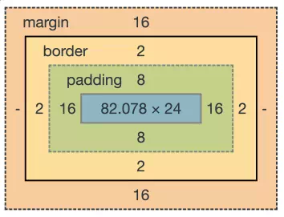
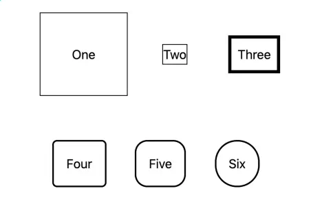
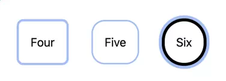
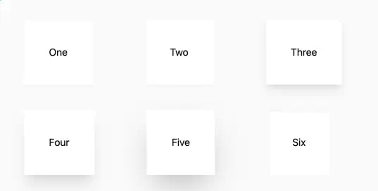
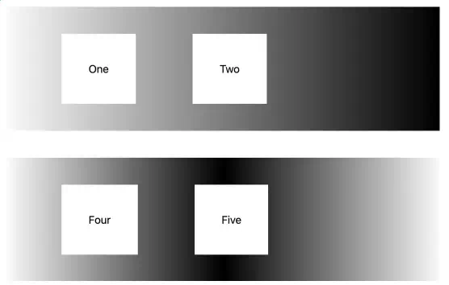
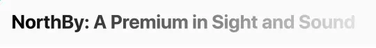

# 第 4 章 盒子（The Box）

DOM 中的每个 HTML 元素在屏幕上都会占据一个矩形空间。
每个浏览器的开发者工具都会显示这个矩形，通常像这样：



如果你没有进行任何自定义，这个盒子的大小就是由元素的内容决定的。
Tailwind 可以让你控制盒子的**各个方面**。

## 能看到盒子吗？

DOM 元素最重要的特性之一就是用户是否能看到它。通过一点 JavaScript，你可以轻松地操作这个特性，实现交互效果。一个常见模式是：在页面初始加载时就加载大量可能用到的 DOM 元素，但让其中很多元素**初始隐藏**，通过改变可见性来更新页面，而无需再次向服务器请求数据。

大多数情况下，如果你想让 DOM 元素对用户不可见，可以使用 Tailwind 的 `hidden` 工具类，它对应的 CSS 属性是 `display: none`。
在 Tailwind 中，`hidden` 的反义通常是 `block`。虽然 CSS 的 `display` 属性有很多可能值，但 Tailwind 的 Preflight 会让很多元素默认使用 `block`。
另一个常见值是 `inline`，不过在 Tailwind 中，你更可能通过 flexbox 或 grid 布局来实现行内行为（第 5 章《页面布局》，第 41 页会详细讲）。

Tailwind 还有 `visible` 和 `invisible` 工具类。

* `hidden` 与 `invisible` 的区别在于：`hidden` 元素**不显示，也不占据 DOM 布局空间**，所以不会影响其他元素的布局；
* 而 `invisible` 元素**不显示内容，但仍占据空间**，它会在页面上留出空白区域，占位但为空。

## 盒子里有什么？

CSS 盒模型有四个部分，从里到外依次是：

* **内容（Content）** —— 内容是元素内部的文字或媒体。（上一章我们已经讲过内容了。）
* **内边距（Padding）** —— 内边距是内容周围但在边框内部的空间。你可以分别为四个方向设置内边距，只设置水平或垂直方向，或者一次性设置所有方向。无论你的站点如何，大概率很多地方都可以加点内边距。
* **边框（Border）** —— 边框是环绕内边距的边缘。边框与内边距的区别在于，你可以为边框指定颜色和样式，在内容和内边距周围画出可见的边界。
* **外边距（Margin）** —— 外边距在边框之外，用来分隔这个元素和其他元素。外边距的设置方式和内边距类似，也可以单独或统一指定方向。

你还可以指定盒子的高度和宽度，可以用绝对值，也可以用可用空间的百分比。
如果明确指定了宽高，未使用的空间会被视为内容的一部分。
如果限制了元素的大小，还可以告诉页面如何处理超出尺寸的内容。
最后，你还能对元素的背景做很多操作。

好了，我们来详细讲讲盒子的各个部分。

## 内边距（Padding）和外边距（Margin）

内边距和外边距并不是紧挨着的——它们之间永远隔着边框（border）。不过在 Tailwind 里，它们的用法挺相似，所以可以放在一起讲。

Tailwind 提供了——如果我数得没错的话——**245 个用于控制内边距的类名**（不算那些自定义数值的情况）。我不会在这里一个个列出来（虽然 Tailwind 的官方文档¹ 里都有），因为它们其实都有规律可循：

**p{方向}-{尺寸}**

所有的内边距类名都是以 **p** 开头，后面可以加一个表示方向的字母。
一共有六种方向：

* **t** 表示上（top）
* **b** 表示下（bottom）
* **l** 表示左（left）
* **r** 表示右（right）
* **x** 表示水平方向（也就是左右）
* **y** 表示垂直方向（也就是上下）

如果没有加方向的字母，那就代表**四个方向的内边距都会被设置**。

默认情况下，Tailwind 定义了 **34 个数字尺寸**，可用于设置内边距（padding）和外边距（margin）。另外还有一个特殊的尺寸 **px**，它代表 **1 像素**。

这些尺寸包括：
0、0.5、1、1.5、2、2.5、3、3.5、4、5、6、7、8、9、10、11、12、14、16、20、24、28、32、36、40、44、48、52、56、60、64、72、80、96。

每个数字都对应 **0.25rem**——也就是页面根元素字体大小的四分之一。

举几个例子：

* `.p-10` 表示四个方向的内边距都是 **2.5rem**；
* `.px-4` 表示水平方向（左右）的内边距是 **1rem**；
* `.pr-1.5` 表示右侧的内边距是 **0.375rem**；
* `.pt-px` 表示上方的内边距是 **1 像素**。

这种设计的目的，是在小尺寸时提供更精细的控制，同时在较大的间距下保持一组一致的数值体系。
你也可以同时使用多个内边距类，控制不同方向，比如：
`class="px-10 py-20"`。

**尺寸模式（Sizing Pattern）**

这种尺寸命名规则是 Tailwind 中常见的一种模式，被用于多种不同的属性。我们在这里看到它用于内边距，比如 **p-24**，但同样的规则也适用于外边距（**m-24**）、高度（**h-24**）和宽度（**w-24**）。

在所有这些情况下，你都可以使用方括号来自定义任意尺寸和单位，比如：
**p-[15px]**。

外边距（Margin）的结构和内边距（Padding）基本一样，只是有几个不同点：

* **外边距类名以 `m` 开头**，命名规则是：`m{方向}-{尺寸}`。
  和内边距一样，你可以分别为不同方向设置外边距。

* **所有方向多了一个特殊的尺寸选项：`-auto`**。
  `auto` 用来让元素在其父容器中**水平居中**。
  你也可以在上下方向使用 `auto`，但那样不会起作用。
  （关于如何让元素垂直居中，我们会在第 5 章《页面布局》第 41 页再讲。）

* **外边距可以是负值**。
  负外边距会让元素比正常情况下更靠近下一个元素，甚至**进入相邻元素的外边距区域**。
  负外边距的写法是在前面加一个 **`-m`**，后面依然可以加方向和尺寸选项，就和普通外边距类一样。

## 边框（Borders）

边框和内外边距有点类似，但稍微复杂一些，因为**边框还可以有自己的颜色和样式**。

边框的尺寸选项相对更少，因为通常你不会希望边框像外边距那样大。更重要的是，**边框的尺寸是以像素（px）为单位**，而不是 rem。

最基本的边框类是 **`border`**，它会在四个方向上都添加 **1 像素**的边框。

接下来是这种格式：**`.border-{边}-{尺寸}`**，其中“边”是可选的。但和 padding、margin 不同的是，**边的前面需要加一个连字符（-）**。

可选的边包括：

* **-b** 表示下边框（bottom）
* **-t** 表示上边框（top）
* **-l** 表示左边框（left）
* **-r** 表示右边框（right）
* **-x** 表示左右两边
* **-y** 表示上下两边

如果没有指定边，那就会把设置应用到四个方向。

尺寸部分也是可选的，有：**-0、-2、-4、-8**，表示边框宽度为多少像素（px）。如果没有写尺寸，就表示宽度为 **1 像素**。
当然，也可以用方括号自定义任意值，比如 `border-[3px]`。

如果“边”或“尺寸”其中一个没有写，就不需要加那个连字符。

例如，以下都是合法的边框宽度类：

* **`border-2`**：没有指定边，表示四个方向都是 2 像素；
* **`border-b`**：没有指定尺寸，表示下边框为 1 像素；
* **`border-r-4`**：表示右边框为 4 像素。

边框线（Border lines）也可以设置样式，这需要用单独的 Tailwind 工具类来实现。
默认情况下，边框是**实线**，使用类名 **`border-solid`**。
Tailwind 还提供了以下几种样式类：

* **`border-dashed`**：虚线边框
* **`border-dotted`**：点状边框
* **`border-double`**：双线边框
* **`border-none`**：无边框

边框还可以设置**颜色和不透明度**。
边框的颜色和透明度设置方式与文字颜色完全相同，只是前缀从 `text` 变成了 `border`。

例如：

* 用 **`border-{color}`** 指定颜色，如 **`border-gray-500`**；
* 在颜色后加上 **`/50`** 表示 50% 不透明度，如 **`border-gray-500/50`**。

可选的颜色和透明度等级都与文字相同。

你也可以只设置某一边的边框颜色，比如：

* **`border-r-gray-500`**（右边框颜色）
* **`border-x-gray-500`**（左右边框颜色）

最后，边框还可以是**圆角**的。
Tailwind 提供了以下 **9 种基础的圆角类名**，每种都对应一个以 rem 为单位的圆角半径大小：


| 类名                   | 圆角半径大小                                           |
| -------------------- | ------------------------------------------------ |
| **rounded-none**     | 半径为 0，没有任何圆角                                     |
| **rounded-sm**       | 0.125rem                                         |
| **rounded**          | 0.25rem                                          |
| **rounded-md**       | 0.375rem                                         |
| **rounded-lg**       | 0.5rem                                           |
| **rounded-xl**       | 0.75rem                                          |
| **rounded-2xl**      | 1rem                                             |
| **rounded-3xl**      | 1.5rem                                           |
| **rounded-full**     | 将圆角半径设为接近无限大（大约 9999 像素），让元素看起来更像一个**圆形**而不是圆角矩形 |
| **rounded-[{size}]** | 允许你用带单位的任意值自定义圆角半径                               |

有时候你可能只想让某一个或两个角是圆的。
我能想到的一种常见情况是：当你有一组元素拼成一个更大的圆角矩形时。

如果需要，你可以在 `rounded` 和尺寸之间加上方向。

你可以用单个方向字母（b、t、l、r）来控制某一边的两个角：

* **b** 表示底部两个角
* **t** 表示顶部两个角
* **l** 表示左边两个角
* **r** 表示右边两个角

也可以用两个字母表示具体的某个角：

* **tl**：左上角
* **tr**：右上角
* **bl**：左下角
* **br**：右下角

因此，一些合法的写法包括：

* **`rounded-tr-md`**（右上角为中等圆角）
* **`rounded-b-full`**（底部两个角为完全圆角）

下面是一个包含外边距和边框选项的小示例：

```html
<div>
    <div class="mb-10">
        <button class="p-10 border border-black">One</button>
        <button class="m-10 border border-black">Two</button>
        <button class="m-2 p-2 border-4 border-black">Three</button>
    </div>
    <div>
        <button class="m-4 p-4 border-2 border-black rounded-md">Four</button>
        <button class="m-4 p-4 border-2 border-black rounded-2xl">Five</button>
        <button class="m-4 p-4 border-2 border-black rounded-full">Six</button>
    </div>
</div>
```    



在上面那一行按钮中，第一个按钮设置了**内边距（padding）**以及包在内边距外面的**边框（border）**；
第二个按钮则设置了**外边距（margin）**，而边框位于外边距的**内部**。

下面那一行按钮展示的是不同的**圆角（rounded）半径**效果。

Tailwind 还提供了一种与边框不同的方式来设置边线，叫做 **ring（光环）**。
相比普通边框，ring 有一些优点：

* 首先，它在圆角元素上**显示效果更好**；
* 其次，它是用 **CSS 的 box-shadow 属性** 实现的，因此**不会影响布局的间距**。

ring 可以设置 **宽度、颜色、不透明度**，还可以有一个可选的**偏移（offset）**。

如果没有指定颜色，默认是一个**半透明的蓝色**，通常用来表现“按钮被选中”的视觉效果。

ring 的命名规则是：**`ring-{宽度}`**，
宽度可选值包括：**0、1、2、4、8**，表示 ring 的像素宽度（类似边框的宽度）。
你也可以只写 **`ring`**，它代表 **3 像素**的 ring。
还有 **`ring-inset`**，它会把 ring 画在**内容区域（content）内部**，而不是边框外侧。
如果想自定义尺寸，也可以用方括号写任意值，比如 **`ring-[5px]`**。

颜色的设置规则是：**`ring-{color}`**，
可以使用任意已定义的颜色。
如果加上斜杠，比如 **`ring-{color}/{opacity}`**，
就能调整不透明度，取值范围和文字颜色的不透明度一致。

另外：

* **`ring-offset-{pixels}`** 可以让 ring 稍微偏移一点；
* **`ring-offset-{color}`** 可以为偏移部分设置颜色。

下面是一个示例：

```html
<div>
    <button class="m-4 p-4 rounded-md ring">Four</button>
    <button class="m-4 p-4 rounded-2xl ring-2">Five</button>
    <button class="m-4 p-4 rounded-full ring-4 ring-offset-4 ring-offset-black" >Six</button>
</div>
```



## 背景颜色（Background Color）

Tailwind 的背景颜色用法和文字颜色、边框颜色很相似，命名规则是：
**`bg-{color}`**。

它使用的颜色名称与其他类别完全一致，比如：

* **`bg-red-700`**
* **`bg-orange-300`**。

Tailwind 还提供了 **`bg-{color}/{opacity}`** 这种写法，可以像文字颜色一样设置不透明度等级。

同样地，你也可以使用方括号来自定义任意值：

* 自定义颜色：**`bg-[#cdcdcd]`**
* 自定义不透明度：**`bg-red-700/[43]`**。

## 阴影（Shadows）

严格来说，**盒阴影（box shadow）** 并不是背景颜色的一种，但它的使用方式和背景有点类似。
Tailwind 提供了一些工具类来控制阴影效果。

最基本的类是 **`shadow`**，它会创建一个 **10% 透明度的黑色阴影**，
阴影向下偏移 **1 像素**，模糊半径大约 **3 像素**。

你可以用修饰符来调整阴影大小：

* **`shadow-xs`**、**`shadow-sm`** → 阴影更小
* **`shadow-md`**、**`shadow-lg`**、**`shadow-xl`**、**`shadow-2xl`** → 阴影更大

（需要注意的是，这里的自定义值比其他 Tailwind 模式复杂一些，详细内容可以参考官方文档：[https://tailwindcss.com/docs/box-shadow](https://tailwindcss.com/docs/box-shadow)）

你还可以通过 **`shadow-{color}`** 来指定阴影的颜色。

此外，Tailwind 还提供了一个特殊的类 **`shadow-inner`**，
它会在元素内部生成轻微的内阴影，让元素看起来像是“凹下去”的。
（不过这个类没有尺寸可选项。）

如果你想取消阴影效果，可以使用 **`shadow-none`**。

正如下方的示例所示，阴影的效果通常比较细微，除非你把它调得比较大。

```html
<div class="bg-gray-50 p-10">
    <div class="mb-10">
        <button class="p-10 mx-10 shadow-sm bg-white">One</button>
        <button class="p-10 mx-10 shadow-sm bg-white">Two</button>
        <button class="p-10 mx-10 shadow-lg bg-white">Three</button>
    </div>
    <div>
        <button class="p-10 mx-10 shadow-xl bg-white">Four</button>
        <button class="p-10 mx-10 shadow-2xl bg-white">Five</button>
        <button class="p-10 mx-10 shadow-inner bg-white">Six</button>
    </div>
</div>
```



Tailwind 还支持 **drop shadow（投影滤镜）**。

盒阴影（box shadow）和投影阴影（drop shadow）的区别比较微妙，对于我们来说，最大区别是 **当元素不是矩形时，drop shadow 的效果更好**，比如带透明背景的图片。

你可以用 **`drop-shadow`** 类来添加投影阴影，并且可以使用和普通阴影（shadow）相同的尺寸修饰符来调整大小。

## 渐变（Gradients）

Tailwind 也可以把背景设置成**渐变色**，不过这通常需要在同一个元素上添加多个类。
我觉得这是我们第一次看到为了实现效果而必须使用多个 Tailwind 类的情况，这种模式在下一章讲页面布局时会更常见。

在纯 CSS 中，渐变是通过 **`background-image`** 属性配合 **`linear-gradient`** 函数来实现的。
你需要指定：

* **方向**
* **起始颜色（from）**
* **结束颜色（to）**
* 可选的 **中间颜色（via）**

在 Tailwind 中，渐变背景的工具类模式是：
**`bg-gradient-to-{方向}`**，方向包括四个边：

* **t**（top）
* **b**（bottom）
* **r**（right）
* **l**（left）

例如：

* **`bg-gradient-to-t`** 表示渐变从底部的“from”颜色开始，过渡到顶部的“to”颜色；
* **`bg-gradient-to-r`** 表示渐变从左边的“from”颜色开始，过渡到右边的“to”颜色。

你还可以使用四个角方向：**tl、tr、bl、br**，用于创建**对角线渐变**。
例如 **`bg-gradient-to-tr`** 表示渐变从左下角开始，斜向到右上角。

如果想取消渐变，可以用 **`bg-none`**。

确定方向后，就可以添加颜色了。
使用的颜色名称和之前一样，但前缀改为 **`from-`、`to-`、`via-`**。

例如，要创建一个从红色到蓝色、从右到左的渐变，需要三个类：

```html
bg-gradient-to-l from-red-500 to-blue-500
```

如果想在中间停在黄色，可以加上 **via**：

```html
bg-gradient-to-l from-red-500 to-blue-500 via-yellow-500
```

如果只指定了 **from** 或同时指定了 **from** 和 **via**，但没有指定 **to**，渐变会过渡到透明。

因为本书是黑白印刷，无法完全展示渐变效果，这里只能用灰度示例说明。

```html
<div>
    <div class="mb-10 bg-gradient-to-r from-gray-50 to-black p-10 w-1/2">
        <button class="p-10 mx-10 bg-white">One</button>
        <button class="p-10 mx-10 bg-white">Two</button>
    </div>
    <div class="mb-10 p-10 w-1/2 bg-gradient-to-r from-gray-50 via-black to-gray-50">
        <button class="p-10 mx-10 bg-white">Three</button>
        <button class="p-10 mx-10 bg-white">Four</button>
    </div>
</div>
```




## 背景图片（Background Images）

CSS 提供了很多用于显示背景图片的属性，Tailwind 对几乎所有这些属性都提供了工具类。

### **指定图片**

如果你想使用来自 URL 的背景图片，Tailwind 提供了控制**显示方式**的工具类，但不提供直接设置 URL 的类。

你有三种方式来指定背景图片的 URL：

1. 使用元素的 **`style=`** 属性，例如：

```html
<div style="background-image: url(whatever)"></div>
```

2. 使用 Tailwind 的**任意值语法**（arbitrary syntax），用方括号包起来，例如：

```html
<div class="[background-image:url({url})]"></div>
```

3. 自己创建 CSS 工具类，例如：

```css
.bg-pattern-image {
  background-image: url(whatever);
}
```

### 定位（Positioning）

当你使用背景图片时，可以指定背景图片在盒子中的位置。
这告诉 CSS 图片的哪一边应与盒子的哪一边对齐。

Tailwind 提供了 **九个工具类**：

* **居中**

```html
bg-center
```

* **四个边**

```html
bg-left
bg-right
bg-top
bg-bottom
```

* **四个角**

```html
bg-left-top
bg-left-bottom
bg-right-bottom
bg-right-top
```

我真的不太明白为什么这里**水平方向要放在前面**，而之前我们讨论角落的时候都是垂直方向放在前面，也不清楚为什么要全部拼出来写。

### 平铺（Tiling）

如果背景图片比盒子小，你可以选择**平铺**它。

* **`bg-repeat`**：水平和垂直方向都平铺
* **`bg-repeat-x`**：只在水平方向平铺
* **`bg-repeat-y`**：只在垂直方向平铺
* **`bg-no-repeat`**：取消平铺，重置设置

另外还有两个特殊选项：**`bg-repeat-round`** 和 **`bg-repeat-space`**，它们会改变平铺时图片的排列方式：

* 默认的平铺会在盒子末尾显示**部分图片**
* **`bg-repeat-space`**：不会显示部分图片，剩余空白会均匀分配在每个平铺图片之间
* **`bg-repeat-round`**：不会留空白，每张图片会被拉伸以填满间隙

### 滚动（Scrolling）

一个常见效果是**在页面滚动时固定背景**，让视口显示图片的不同部分。

* **`bg-fixed`**：固定背景
* 相反，如果你希望背景随内容滚动，可以用 **`bg-local`** 或 **`bg-scroll`**，
  取决于你是否希望视口内出现滚动条。

### 位置（Location）

你可以指定**盒子中显示背景图片的部分**。

* 默认是 **`bg-clip-padding`**：背景图片显示在内容区和内边距（padding）内，但不显示在边框（border）上。
* **`bg-clip-border`**：背景图片覆盖到边框区域
* **`bg-clip-content`**：背景图片只显示在内容区，不包括内边距

更有趣的是 **`bg-clip-text`**，它只在**文本内容的形状内**显示背景图片。
通常需要配合 **`text-transparent`** 使用，这样文本颜色不会遮挡背景，就可以只在文字内部看到背景颜色或图片。
如果结合渐变使用，就能实现文字渐变效果，如下例所示：

```html
<div class="bg-gray-50">
    <div class="text-6xl font-bold p-10">
        <div class="bg-clip-text text-transparent py-2 bg-gradient-to-l from-gray-50 to-black">
            NorthBy: A Premium in Sight and Sound
        </div>
    </div>
</div>
```



### 滤镜（Filters）

CSS 定义了许多滤镜来影响元素的显示，Tailwind 也提供了对应的工具类。

* **模糊**

  * **`blur`**：模糊元素（默认 8 像素）
  * **`bg-blur`**：只模糊背景
  * 其他尺寸：**`blur-sm`**（更小）、**`blur-md`、`blur-xl`、`blur-2xl`、`blur-3xl`**
  * 对背景使用时，在类名前加 **`bg-`**

* **灰度与复原**

  * **`grayscale`**：元素灰度化
  * **`grayscale-0`**：取消灰度

* **褐色调与复原**

  * **`sepia`**：元素褐色化
  * **`sepia-0`**：取消褐色化

* **亮度**

  * **`brightness-{level}`** 调整亮度
  * 可选等级：0、50、75、90、95、100（正常）、105、110、125、150、200

* **对比度**

  * **`contrast-{level}`** 调整对比度
  * 可选等级：0、50、75、100、125、150、200

* **饱和度**

  * **`saturate-{level}`** 调整饱和度
  * 可选等级更少：0、50、100、150、200

这三类工具都可以用**方括号**自定义任意值。


## 高度与宽度（Height and Width）

在 CSS 中，元素的高度和宽度一直比较难控制。Tailwind 提供了一些工具类来处理尺寸，但要记住，尺寸通常还会受到**父元素大小和内容大小**的影响。

Tailwind 使用以下模式来设置宽高：

* **`w-{size}`**：宽度
* **`h-{size}`**：高度

对于宽度和高度，Tailwind 提供了一组固定尺寸选项，使用的数字和我们之前在内外边距中看到的一样，每个数字对应 **0.25rem**。

**特殊选项包括：**

* **`-auto`**：自动尺寸
* **`-px`**：1 像素
* **`-full`**：父容器的 100%
* **`-screen`**：视口的 100%
* **`-min`**：最小内容尺寸（CSS `min-content`）
* **`-max`**：最大内容尺寸（CSS `max-content`）
* **`-fit`**：适合内容的尺寸（CSS `fit-content`）

你可以用在类名里，比如：

```html
h-0, w-8, h-px
```

* **`-min`**：把盒子缩到内容的最小尺寸
* **`-max`**：把盒子撑到内容的最大尺寸
* **`-fit`**：盒子宽度在最小内容和最大内容之间取合适的尺寸


Tailwind 还提供了一系列 **相对宽度选项**。

* 你可以使用分数来设置宽度，例如：

  * **`.w-1/2`** → 50%
  * 还有二分之一、三分之一、四分之一、五分之一、六分之一以及十二分之一（十二分之一只用于宽度，不适用于高度）
  * 示例类名：**`.w-3/4`、`.h-2/6`、`.w-7/12`**

这些宽度可以用来模拟网格布局，但实际上使用 **Grid 布局** 更方便（详见第 5 章《页面布局》，第 41 页）。

CSS 还允许指定 **最小和最大高度、宽度**，Tailwind 对此提供了一些有限的工具类：

* 最小值：**`.min-h-0`**、**`.min-h-full`**、**`.min-w-0`**、**`.min-w-full`** → 分别表示最小为 0 或父容器的 100%
* 其他后缀：**`-min`、`-max`、`-fit`** 同样适用于高度和宽度
* 对于高度，还有视口相关的选项：**`.min-h-screen`**


在最大值方面：

* **高度（Height）**

  * 使用 **`max-h-{size}`**，尺寸可选值与之前的数字列表相同
  * 特殊类：**`.max-h-full`**（父容器高度的 100%）、**`.max-h-screen`**（屏幕高度的 100%）

* **宽度（Width）**

  * **`.max-w-0`** → 宽度为 0
  * **`.max-w-none`** → 无限制宽度（CSS 中与 0 不同）
  * 尺寸类：**`max-w-{size}`**，size 可选：xs、sm、md、lg、xl、2xl …… 7xl

    * **xs** = 20rem
    * **7xl** = 80rem
  * **文本特殊类**：**`max-w-prose`** → 约 65 个字符宽
  * **父容器 100%**：**`.max-w-full`**
  * **屏幕尺寸相关**：**`.max-w-screen-sm`、`.max-w-screen-md`、`.max-w-screen-lg`、`.max-w-screen-xl`、`.max-w-screen-2xl`**

    * （屏幕宽度内容将在第 7 章《响应式设计》第 59 页详细讲解）

现在盒子尺寸设置好了，我们可以开始讨论**整个页面的布局**了。
