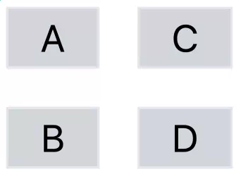

# 第 5 章 页面布局

在上一章中，我们讲了如何用 Tailwind 控制单个 DOM 元素的显示方式。
这一章，我们要看看 Tailwind 是怎样帮你管理多个元素的布局的。

通过 Tailwind，你可以为整页内容进行布局，处理常见的结构，比如导航栏、侧边栏和页脚。
你还可以用 Tailwind 在页面中组合出更复杂的元素结构，比如卡片（cards）或主视觉区块（hero blocks）。

我们先从一些 Tailwind 提供的通用工具开始，这些工具可以帮助我们在页面上定位元素：也就是盒与盒之间的关系。

## 容器（Containers）

许多 CSS 框架都会使用一个名为 **container** 的类，作为页面最外层的通用容器，用来指定页面的宽度。
Tailwind 也提供了一个 container 工具类，但它的功能比其他框架中的同类要简单得多。

在 Tailwind 里，**container** 工具类唯一做的事情，就是根据浏览器视口（viewport）的宽度来设置元素的 **最大宽度（max-width）**。
举个例子：当视口宽度在 640 到 768 像素之间时，最大宽度会被设置为 640 像素；
当视口超过 768 像素后，最大宽度会保持在 768 像素，直到视口达到 1024 像素；
接着当视口到达 1280 像素时，最大宽度又会跳到下一个值。

使用 container 的好处是，它让你只需要关注这些 **特定的断点宽度**，而不用去考虑视口可能出现的所有宽度情况。

---
**视口（Viewports）**

在 CSS 中，**视口（viewport）** 是指浏览器中用户可见的内容区域。
通常我们更关注的是视口的**宽度**，因为它决定了在不需要横向滚动的情况下，屏幕上能展示多少内容。

HTML 中的 `<meta>` 标签可以用来控制移动端屏幕的视口宽度。
默认情况下，移动端浏览器往往会假设设备的显示区域比实际更宽（通常是 980 像素），然后把内容缩放以适配屏幕。
但那样的效果通常很糟糕。

因此，你应该使用以下属性：
`content="width=device-width,initial-scale=1"`
这样浏览器就会以设备的实际宽度作为视口宽度，而不是从一个更宽的尺寸缩放下来。
---

如果你熟悉其他框架，你可能会发现 Tailwind 的 container 没有你预期中的那些功能。
Tailwind 的 container **不会自动让它的子元素在水平方向居中**。
要实现这种居中效果，需要把 container 和 **`mx-auto`** 搭配使用。

另外，Tailwind 的 container **不会自动添加内边距或外边距**，来让内容与浏览器边缘保持距离。
如果想要这种效果，需要配合 **`m-`**（外边距）或 **`p-`**（内边距）类一起使用。

所以，一个合理的顶层元素类名组合可能是：
`class="container mx-auto py-12 px-6"`

## 浮动与清除（Floats and Clears）

虽然在新的设计中，我们通常会使用本章后面要介绍的 **grid** 和 **flexbox** 工具来定位元素，
但如果你在一个旧项目中使用 Tailwind，可能仍然需要处理 **浮动（float）** 和 **清除浮动（clearfix）**。

在 CSS 中，**float** 属性用于在容器内部定位内容。
通常，它会把某个元素（常见的是图片）固定在容器的一侧（左或右），
这样容器中的其他内容（通常是文字）就能环绕在另一侧，而不会和这个元素混在一起。

Tailwind 提供了以下浮动工具类：

* `float-left`：元素左浮动
* `float-right`：元素右浮动
* `float-none`：取消浮动（重置为默认状态）

**clear** 属性则用于强制一个元素放在任何可能与之重叠的浮动元素的下方。
（严格来说，它是阻止其他元素在指定方向上浮动，但效果相同。）

Tailwind 提供了用于指定清除行为的工具类，可以控制单侧、双侧或不清除：

* `clear-left`
* `clear-right`
* `clear-both`
* `clear-none`

## 定位与层级（Position and Z-Index）

在 CSS 中，**z-index** 属性是一个整数，用来决定元素在屏幕上的堆叠顺序——
也就是沿着垂直于屏幕的 “z 轴” 上，哪个元素在上、哪个在下。

Tailwind 提供的语法是 **`z-{index}`**，其中 index 可以是：
`0`, `10`, `20`, `30`, `40`, `50`，或者 `auto`。

如果你想使用负的 z-index 值，可以使用带负号的写法，比如：
`-z-20`，或者使用任意值语法：`z-[-1]`。

## 表格（Tables）

在早期，使用 **表格（table）** 是排版 HTML 页面的一种经典方式。
不过现在，除非你是真正在展示表格数据，否则在布局上更推荐使用 **CSS Grid**。
因此，Tailwind 并没有为表格提供太多专门的工具类。

Tailwind 允许你使用 **`table-auto`** 来保持浏览器默认的自动列宽行为——
也就是根据每一列的内容自动分配宽度。

如果你想要**手动指定列宽**，可以在 `<table>` 元素上使用 **`table-fixed`**，
然后为表格中的每一列添加明确的宽度辅助类。
在这种情况下，**分数类（fractional helpers）** 会特别有用。

```html
<table class="table-fixed border border-collapse">
    <tr>
        <th class="border border-black w-1/6">Small</th>
        <th class="border border-black w-2/6">Medium</th>
        <th class="border border-black w-3/6">Large</th>
    </tr>
</table>
```


Tailwind 还允许你使用 **`border-collapse`** 工具类，把相邻表格单元格的边框合并在一起；
如果想恢复为分开的边框，可以使用 **`border-separate`**。

另外，Tailwind 提供了 **`odd:`** 和 **`even:`** 修饰符，用来为表格行设置交替的背景色。
例如：
`class="odd:bg-white even:bg-gray-300"`
就可以让奇数行背景为白色，偶数行背景为灰色。

## 网格（Grids）

早期 CSS 框架的一大创新，就是引入了**网格布局（grid layout）**的概念，
让你可以轻松地在一个 **12 列网格系统**上摆放内容。
有了网格间距（grid spacing）之后，页面布局变得简单得多。
随着时间发展，这些框架变得越来越灵活，最后 **网格布局功能被直接加入了 CSS 本身**。

网格依然是很多布局场景下的绝佳选择，
而 Tailwind 提供了一系列实用的工具类，
可以通过 **CSS Grid 属性** 来快速建立网格布局。

首先，有一个基础工具类 **`grid`**，
它对应于 CSS 属性 `display: grid`。
在创建网格时，**需要在网格容器（grid 的最外层元素）上添加这个类**，
而不是加在网格里的单个子元素上。

创建好网格容器后，你可以用 Tailwind 来：

* 指定网格中的**行数或列数**；
* 调整网格中**每个子元素的行为**；
* 为网格元素**设定起始或结束位置**；
* 指定元素**跨越的行数或列数**；
* 或者调整网格中各个元素之间的**间距（spacing）**。

网格最常见的用途，就是**把页面分成多列**。
在 Tailwind 中，你可以使用 **`grid-cols-{count}`** 这一类工具来实现。
这些类从 **`grid-cols-1`** 一直到 **`grid-cols-12`**，
分别表示将页面分成对应数量的列。
如果你想重置（退出网格列设置），可以使用 **`grid-cols-none`**。

和一些其他 CSS 网格框架不同，Tailwind 不需要你**显式地定义行（row）**。
在网格中，CSS 会根据你定义的列数，**自动把元素往下填充到下一行**。

比如，你可以像这样使用：

```html
<div class="grid grid-cols-2 w-1/4 gap-4">
    <div class="border bg-gray-300 text-center">A</div>
    <div class="border bg-gray-300 text-center">B</div>
    <div class="border bg-gray-300 text-center">C</div>
    <div class="border bg-gray-300 text-center">D</div>
</div>
```

最终，你会得到一个 2x2 的网格：

* **A 和 B** 在第一行
* **C 和 D** 在第二行

布局大致如下：


CSS 网格的一个很酷的功能是——在一些其他 CSS 框架里很难实现——
你可以通过指定行数，让网格“旋转 90 度”。

在 Tailwind 中，这可以用 **`grid-rows-{count}`** 来实现，
其中 `{count}` 可以是 **1 到 12** 或 **none**。

你还可以指定网格中元素的排列方向。
默认的 **`grid-flow-row`** 会让元素**按行水平排列**，就像前面例子里那样，
这也是你平常最熟悉的 DOM 元素行为。

如果使用 **`grid-flow-col`**，元素会**按列垂直排列**，
从上到下、再到下一列，效果如下：

```html
<div class="grid grid-rows-2 w-1/4 gap-4 grid-flow-col">
    <div class="border bg-gray-300 text-center">A</div>
    <div class="border bg-gray-300 text-center">B</div>
    <div class="border bg-gray-300 text-center">C</div>
    <div class="border bg-gray-300 text-center">D</div>
</div>
```

这样你会得到一个 2x2 的网格：

* **A 和 B** 在左列
* **C 和 D** 在右列

布局大致如下：



正如前面的例子所示，你可以用 **`gap-{size}`** 这个工具类，在表格单元格或网格元素之间添加间距。
`{size}` 的取值遵循和 **padding**、**margin** 相同的规则：从 0 到 96 的数字，也可以使用 `px`。

如果你只想设置**水平间距**，可以使用 **`gap-x-{size}`**；
如果只想设置**垂直间距**，可以使用 **`gap-y-{size}`**。

### 跨越（Span）

就像在 CSS 表格里一样，有时你希望一个单元格**跨越多行或多列**。
Tailwind 提供了两种方式来实现：**span** 和 **start/end**。

使用 **span** 时，你可以通过 **`col-span-{count}`** 或 **`row-span-{count}`** 来指定单元格占用的列数或行数，
其中 `{count}` 是列数或行数。
默认值是 **`col-span-1`** 或 **`row-span-1`**。
如果想重置，可以使用 **`col-span-auto`** 或 **`row-span-auto`**。

需要注意的是，**元素的排列流仍然会继续**。
例如，如果你给第一个元素添加跨列或跨行的设置，在我们的四单元格例子中，会是这样：

```html
<div class="grid grid-cols-2 w-1/4 gap-4">
    <div class="border bg-gray-300 text-center col-span-2">A</div>
    <div class="border bg-gray-300 text-center">B</div>
    <div class="border bg-gray-300 text-center">C</div>
    <div class="border bg-gray-300 text-center">D</div>
</div>
```

结果会是这样的：


你也可以让元素**跨行（row-wise span）**，效果如下：

```html
<div class="grid grid-cols-2 w-1/4 gap-4">
    <div class="border bg-gray-300 text-center row-span-2">A</div>
    <div class="border bg-gray-300 text-center">B</div>
    <div class="border bg-gray-300 text-center">C</div>
    <div class="border bg-gray-300 text-center">D</div>
</div>
```

结果会是这样的：


### 起始/结束（Start/End）

你可以通过指定**起始和结束位置**来调整网格中元素的摆放：

* 水平方向使用 **`col-start-{column}`** 和 **`col-end-{column}`**
* 垂直方向使用 **`row-start-{row}`** 和 **`row-end-{row}`**

其中，后缀可以是具体的列或行编号，也可以是重置值 **`auto`**。

关键点：

1. 最低的起始位置编号是 **1**。
2. **结束位置是排他性的**，也就是说结束编号本身不属于元素。

例如：
`class="col-start-2 col-end-4"`
表示元素覆盖 **第 2 列和第 3 列**，但不包括第 4 列。

默认情况下，元素的起始和结束位置由网格中前面元素的位置自动确定，跨越列数（span）默认为 1。
你可以指定 **起始（start）**、**结束（end）** 或 **跨越（span）** 中的任意两个，布局依然有效。

例如：
`class="col-span-3 col-end-5"`
表示元素跨 **3 列**，覆盖第 2、3、4 列，结束于第 5 列之前。

## 列（Columns）

如果你想做一个更经典的杂志式布局，也可以使用 **列流（column flow）**，这对图片布局也很适用。

在 Tailwind 中，你可以通过两种方式指定列布局：

1. **按列数**：使用 **`column-{count}`**，列数从 1 到 12。
2. **按列宽**：使用 **`column-{size}`**，列宽从 `2xs`、`xs`、`sm`、`md`、`lg`、`xl`，然后是 `2xl` 到 `7xl` 不等。

   * 宽度范围不规则，从 **16rem 到 80rem**，也可以使用方括号语法指定任意宽度：`column-[{size}]`。

使用 **`column-auto`** 可以重置列设置。

和网格布局一样，你也可以用 **gap 系列类**来设置列之间的间距。


## 弹性盒子（Flexbox）

Flexbox 是另一种排列多个相关元素的方式。
与 **网格（grid）** 是二维布局不同，**Flexbox 是一维布局**，
它会把元素按行或列一个接一个地排列。

听起来好像没网格那么强大，但 **Flexbox 对你可能更有用**，原因有三：

1. Flexbox 容器对元素的动态尺寸管理更灵活。
2. 虽然 Flexbox 容器本质上是一行，但当内容过宽时，它可以**自动换行**。
3. Flexbox 容器可以**嵌套**，
   比如你可以先创建一个行方向的 Flexbox，
   里面的元素又可以是列方向的 Flexbox，
   列里面还可以再包含行方向的 Flexbox。
   通过嵌套 Flexbox，你可以获得非常丰富的布局控制能力。

网格依然适合用于**表格类内容的管理**，比如某些数据展示，但并不是所有布局场景都需要用网格。

想象一个常见的页面结构：

* 顶部是**全宽的页眉（header）**
* 下面是**左右侧边栏**，中间是**主内容区**
* 最底部是**全宽的页脚（footer）**

你可以把这个布局看作一个网格：

1. **第一行**：页眉，占三列（column span = 3）
2. **第二行**：左侧栏、主内容区、右侧栏，共三列，各自宽度可调整
3. **第三行**：页脚，占三列（column span = 3）

布局示意如下：

```html
<div class="grid grid-cols-3 gap-4 w-1/3">
    <div class="text-center col-span-3">Header</div>
    <div class="text-center w-1/5">Left Sidebar</div>
    <div class="text-center w-3/5">Content</div>
    <div class="text-center w-1/5">Right Sidebar</div>
    <div class="text-center col-span-3">Footer</div>
</div>
```

这种布局也可以用 **Flexbox** 来实现。
你可以把整体 Flexbox 设置为**列方向（column）**，包含三个元素：

* 第一元素：页眉
* 第二元素：一个**行方向（row）的 Flexbox**，包含左侧栏、主内容区、右侧栏
* 第三元素：页脚

```html
<div class="flex flex-col w-1/3">
    <div class="flex-grow">Header</div>
    <div class="flex flex-row">
        <div class="text-center w-1/5">Left Sidebar</div>
        <div class="text-center w-3/5">Content</div>
        <div class="text-center w-1/5">Right Sidebar</div>
    </div>
    <div class="flex-grow">Footer</div>
</div>
```

或者，你也可以把页面看作一个**单行（row）的 Flexbox**，
它会根据内容自动换行，布局效果如下：

```html
<div class="flex flex-row flex-wrap w-1/3">
    <div class="w-full">Header</div>
    <div class="text-center w-1/5">Left Sidebar</div>
    <div class="text-center w-3/5">Content</div>
    <div class="text-center w-1/5">Right Sidebar</div>
    <div class="w-full">Footer</div>
</div>
```

这三种方式最终都会得到大致相同的布局：


事实证明，**Flexbox 比网格更灵活**。
尤其是在适应不同屏幕尺寸时，Flexbox 布局要容易得多。

## 方向与轴（Direction and Axis）

Flexbox 布局的基础是 **方向（direction）**，
在 Tailwind 中，你可以用工具类来设置方向：

* **水平**：`flex-row`
* **垂直**：`flex-col`
* **反向水平**：`flex-row-reverse`
* **反向垂直**：`flex-col-reverse`

在流动方向上称为 **主轴（main axis）**，
另一条方向称为 **交叉轴（cross axis）**。

在 Tailwind 中，**父容器必须包含 `flex` 类**（就像网格布局需要 `grid` 类一样）。

需要注意的一点是：

* 水平方向（row）并不一定是从左到右，行的流动方向**跟随文本方向**。
  例如，如果你的文本是希伯来语，Flexbox 的方向会自动翻转。
* 垂直方向（column）的主轴始终是从上到下。

## 顺序与换行（Order and Wrap）

Flexbox 的另一个重要属性是 **是否换行（wrap）**，这是父容器的属性。

* 默认情况下 **不换行**，使用 **`flex-no-wrap`**
* 如果设置 **`flex-wrap`**，当元素超过容器主轴时，会自动移到下一行

  * 对行方向 Flexbox，就是超过容器宽度
  * 对列方向 Flexbox，可以通过显式设置高度实现换行

如果你需要反向换行，Tailwind 提供 **`flex-wrap-reverse`**。

Flexbox 中，你可以用 **`order-{integer}`** 明确指定元素顺序，
后缀 `{integer}` 可为 1 到 12，也可以使用：

* `order-first`：最前
* `order-last`：最后
* `order-none`：重置

如果元素超过 12 个，也可以用任意值语法，比如：`order-[42]`。
当元素设置了 order 后，显示顺序会**覆盖 HTML 源代码中的顺序**。

这个属性的一个常见用途是：
在源代码中让主内容先出现，但在页面上仍能正确显示其他布局。
这样，你就能实现和前面例子相同的布局效果。

```html
<div class="flex flex-row flex-wrap w-1/3">
    <div class="text-center w-3/5 order-3">Content</div>
    <div class="w-full order-1">Header</div>
    <div class="text-center w-1/5 order-2">Left Sidebar</div>
    <div class="text-center w-1/5 order-4">Right Sidebar</div>
    <div class="w-full order-5">Footer</div>
</div>
```

这么做的一个原因是：
可以让**自适应屏幕阅读器**更快地访问主要内容，同时页面的视觉布局仍然可以把内容放在中间。


## 伸缩（Grow, Shrink…Flex）

Flexbox 的 “flex” 就来源于容器能够**动态调整内部元素的大小和位置**。
Tailwind 提供了一些常用默认工具类，用于设置**Flexbox 内部元素**的属性，而不是父容器。

如果你想指定元素在 Flexbox 中的尺寸，可以使用 **`basis-{size}`** 类，
它对应 CSS 的 **`flex-basis`** 属性。

* **flex-basis** 决定元素在主轴方向上的大小：

  * 行方向（row）：控制宽度
  * 列方向（column）：控制高度
* 设置了 flex-basis 后，会覆盖元素原有的 width 或 height 属性。

Tailwind 的 **basis** 尺寸选项几乎与 width 的选项相同：

* 标准数字从 0 到 80
* 还支持分数：1/2、1/3、1/4、1/5、1/6、1/12
* 以及：`auto`、`px`、`full`
* 示例：`basis-4`、`basis-3/5`、`basis-auto`
* 还可以使用任意值语法，例如：`basis-[20px]`

如果没有指定具体尺寸，Flexbox 会**自动调整容器内元素的大小**，让它们填满可用空间。

* 如果你不希望某个元素增长或缩小，可以使用 **`flex-none`**，保持其默认大小。
* 如果你希望元素根据容器的可用空间**自由增长或缩小**，可以使用 **`flex-auto`** 或 **`flex-1`**。

两者的区别：

* **`flex-auto`**：从元素的默认大小开始，然后按可增长或可缩小的元素调整尺寸
* **`flex-1`**：先将所有元素大小重置为 0，然后平均分配空间，不考虑元素原有大小

一般来说：

* 对一组元素使用 **`flex-1`** 会得到等宽（等高）的元素
* 使用 **`flex-auto`** 则不会强制等大小

你也可以单独指定缩小行为而不影响增长：

* **允许缩小**：`flex-shrink`
* **禁止缩小**：`flex-shrink-0`

同样地，增长行为也可以单独控制：

* **允许增长**：`flex-grow`
* **禁止增长**：`flex-grow-0`

## 盒子对齐（Box Alignment）

除了使用 Flexbox 来排列页面元素，Tailwind 还提供了一些工具类，
可以更精确地控制元素在 Flexbox 内的**对齐（alignment）**和**分布（justification）**。
这些工具类在适用的情况下也可用于 Grid 布局。

前面提到过，Flexbox 容器有 **主轴（main axis）** 和 **交叉轴（cross axis）**。

* 影响 **主轴方向** 上元素摆放的 Tailwind 工具类以 **`justify-`** 开头
* 影响 **交叉轴方向** 的工具类则没有这个前缀

这些命名与 CSS 的原生属性名称保持一致。

### 主轴（Main Axis）

先来看主轴方向。
在主轴上，元素的位置可以通过两种方式指定：

1. **整个 Flexbox 容器的主轴上元素的整体摆放**
2. **单个元素在自己所在 Flexbox 单元格的主轴上摆放**

这两种摆放方式可以分别定义，并且都是 **父容器（Flexbox 容器）的属性**，而不是单个元素的属性。

当在主轴上摆放元素时，Tailwind 提供了工具类来控制：

* 当元素总宽度小于容器宽度时，额外空间如何分配
  这些工具类决定了元素之间和元素与容器边缘的**间距分配方式**。

有三种工具类可以把元素尽可能靠拢：

* **`justify-start`**：将元素靠主轴起点排列，方向依据文本方向
* **`justify-end`**：将元素靠主轴终点排列
* **`justify-center`**：将元素居中排列——这是 CSS 中长期令人头疼的问题之一

还有三种工具类用于在元素之间分配间距，它们的区别在于间距放置的位置：

* **`justify-between`**：第一个元素靠容器起点，最后一个元素靠容器终点，内部元素之间均匀分布间距

  * 三个元素的排列模式：`A x B x C`，中间有两段相等的间距
* **`justify-evenly`**：每个元素周围都分配相等的间距

  * 三个元素的排列模式：`x A x B x C x`，共有四段相等间距
* **`justify-around`**：每个元素两侧都有相等间距

  * 实际上两端间距小于内部间距，因为内部间距包含了相邻两个元素的左右间距
  * 三个元素的排列模式：`x A x x B x x C x`，总共有六段相等间距

元素在自己所在单元格内的位置，可以通过父容器的工具类控制：

* **`justify-items-start`**：靠单元格起点
* **`justify-items-end`**：靠单元格终点
* **`justify-items-center`**：居中
* **`justify-items-stretch`**：元素拉伸填满单元格
* **`justify-items-auto`**：重置默认行为

通常，你只需要使用 **`justify-`** 来控制整体元素间距，或者 **`justify-items-`** 来控制单元格内元素对齐，不必同时使用两者。

如果某个单元格内的单个元素想要覆盖容器的对齐设置，可以使用 **`justify-self-{option}`**，选项与 **`justify-items`** 的五个值相同。

### 交叉轴（Cross Axis）

交叉轴方向的工具类与主轴类似。

* 主轴用 **`justify-`**，交叉轴用 **`content-`**，同样有六个选项：

  * 例如 **`content-start`**：将多行 Flexbox 的元素推到顶部
  * **`content-center`**：在交叉轴上垂直居中

对于单个元素，工具类与 **`justify-items-`** 类似，但前缀改为 **`items-`**：

* 例如 **`items-center`**：在交叉轴上垂直居中元素

同样地，单个元素可以覆盖父容器设置，前缀为 **`self-`**：

* 例如 **`self-start`** 或 **`self-center`**

最后，你可以同时管理主轴和交叉轴，使用以下前缀：

* **`place-content-`**
* **`place-items-`**
* **`place-self-`**

效果相当于同时设置了主轴和交叉轴的对齐：

* **`place-content-center`** ≈ `justify-center` + `content-center`
* **`place-items-start`** ≈ `justify-items-start` + `items-start`

接下来，我们来看如何让这些 Tailwind 工具类实现更动态的行为。
