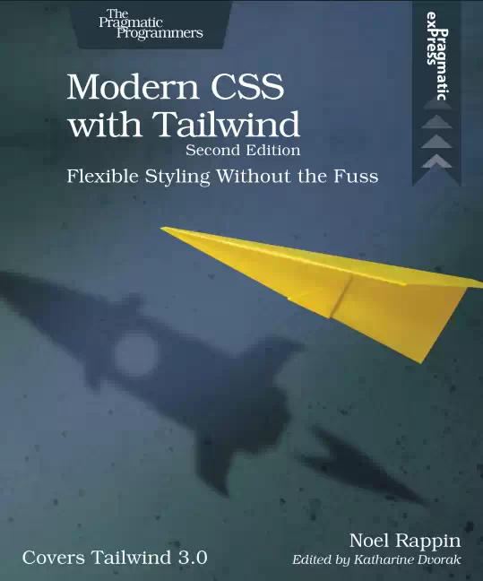

---
next:
  text: '前言'
  link: '/modern-css-with-tailwind/preface'
---

# Tailwind 现代 CSS 样式 (第二版) 
> 轻松灵活的样式设计，如同搭积木一样快速进行网页设计，方便、快捷与直观

## 目录

- [**前言**](preface)
- [**简介**](introduction)
- [第1章 Tailwind 入门](ch01)
- [第2章 Tailwind 基础](ch02)
- [第3章 排版](ch03)
- [第4章 盒子（The Box）](ch04)
- [第 5 章 页面布局](ch05)
